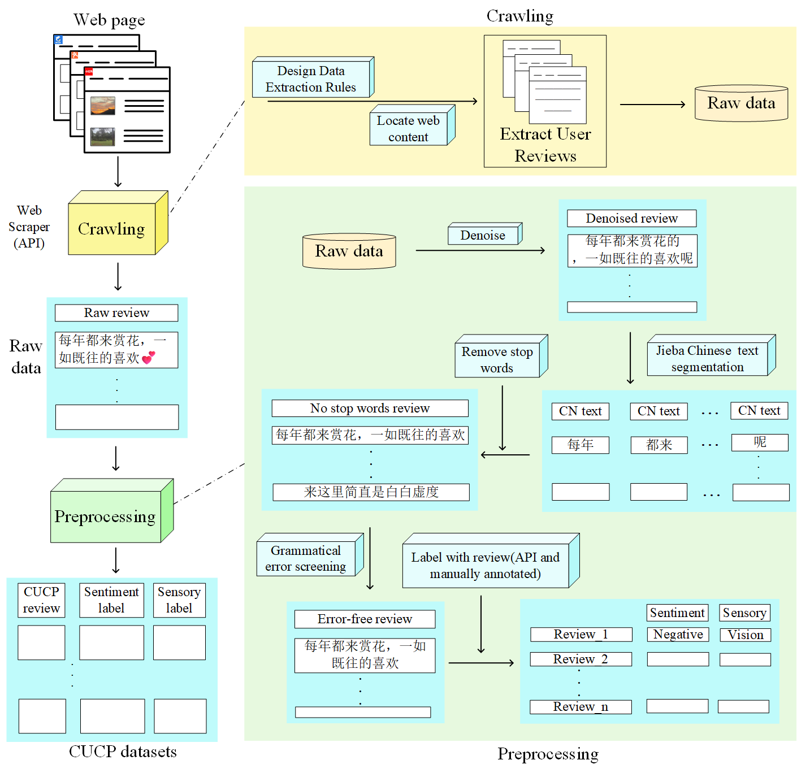

# CUCP-datasets
CUCP(A Chinese User Comment Dataset Focused on Urban Parks) datasets 

In this paper, we propose a Chinese user comment dataset focused on urban parks, named CUCP. First, the dataset is sourced from popular Chinese review platforms: Dianping, Ctrip, and Xiaohongshu. Second, the reviews cover two aspects: sentiment and sensory. The sentiment reviews can be classified as positive or negative, while the sensory reviews are categorized into vision, touch, taste, smell, and hearing.Third, our dataset contains 103,831 entries, which surpass the dataset sizes of most related studies, reflecting its richness and diversity.Last, we fine-tune several common natural language processing (NLP) models, such as BERT, RoBERTa, ELECTRA, and XLNet. The results show that for both sentiment and sensory classification, the model's accuracy, precision, recall, and $F1$ score are all above 90\%, indicating that the CUCP dataset is an excellent resource. The dataset is available at https://github.com/Acui001/CUCP-datasets.

