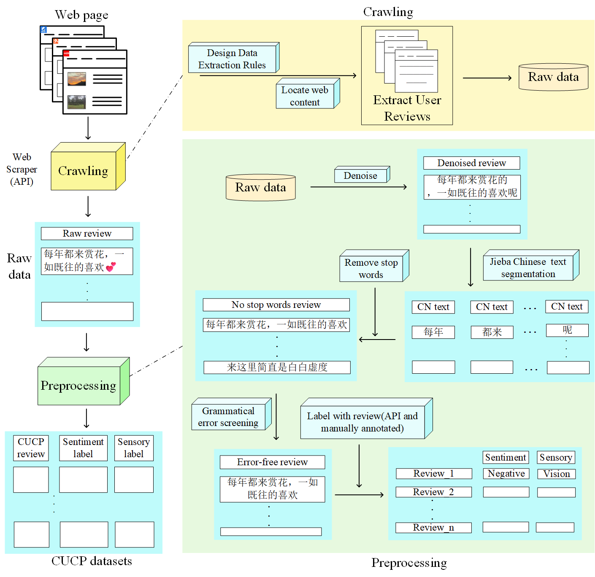

# CUCP-datasets

**CUCP：中国城市公园用户评论数据集**

📘 English version: [README.md](README.md)

📌 **当前状态：论文审稿中**

---

### 🧬 数据处理流程

下图展示了构建 CUCP 数据集的主要步骤：

---

### 🧮 标签分布

| 感官类型 | 总数   | 正向样本 | 负向样本 |
|----------|--------|----------|----------|
| 触觉     | 23,764 | 18,901   | 4,863    |
| 视觉     | 70,321 | 56,331   | 13,990   |
| 味觉     | 5,741  | 4,340    | 1,401    |
| 嗅觉     | 1,876  | 1,701    | 175      |
| 听觉     | 2,129  | 1,802    | 327      |

这种结构化的标注方式使 CUCP 数据集适用于 **多分类**、**多标签** 和 **二分类情感分析** 等任务。

---

### 📂 数据发布情况

> 🔒 **完整数据将在论文录用后公开发布。**

目前，我们已发布一小部分示例数据用于展示和验证。  
您可以在此查看示例文件：**[demo_CUCP.csv](demo_CUCP.csv)**

---

### 🔗 数据集仓库链接

CUCP 数据集将托管在以下地址：  
**https://github.com/Acui001/CUCP-datasets**

---

### 📮 联系方式

如有任何问题，或希望进行早期合作，请联系：  
📧 acuicuiemail@163.com
